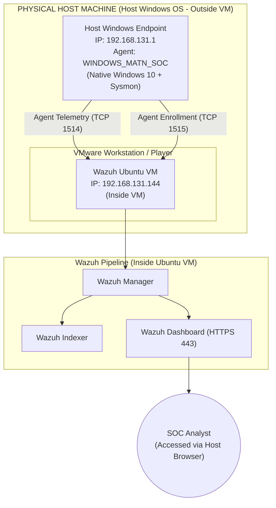
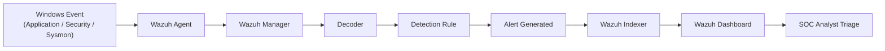
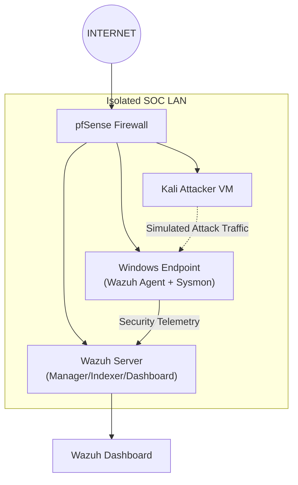
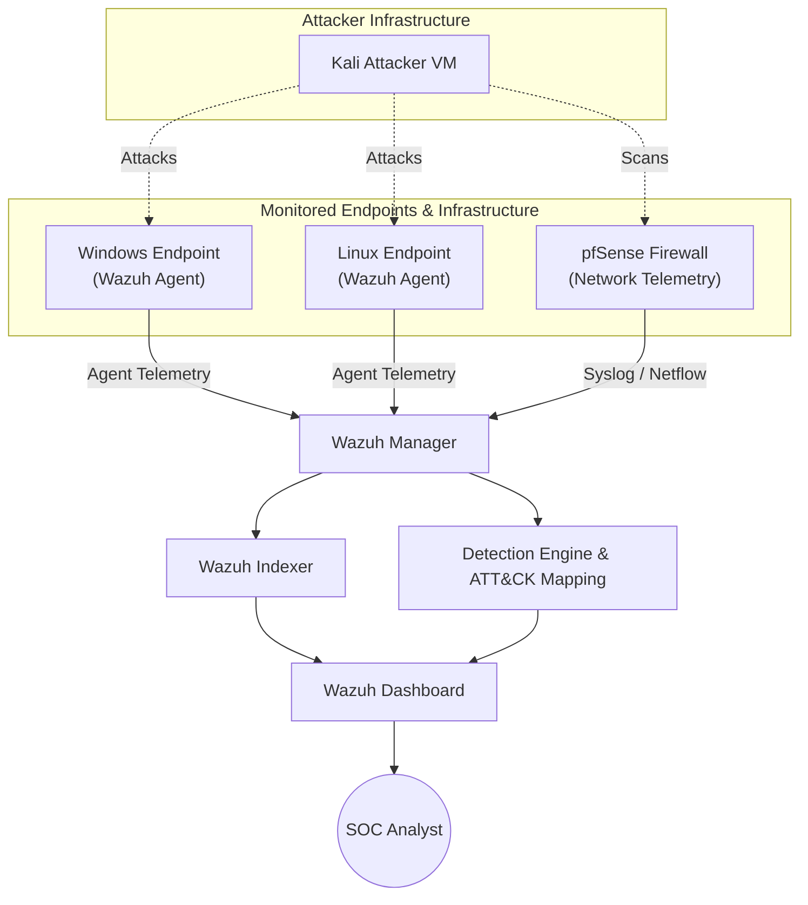

# Wazuh SOC & XDR Lab

A hands-on cybersecurity lab built around **Wazuh** for learning Security Information and Event Management (SIEM), endpoint monitoring, security configuration assessment, vulnerability management, detection engineering, threat hunting, and incident response.

The lab currently contains:

- Wazuh Server
- Wazuh Manager
- Wazuh Indexer
- Wazuh Dashboard
- Filebeat
- Windows endpoint
- Wazuh Windows Agent
- Windows Event Log monitoring
- Security Configuration Assessment (SCA)
- Sysmon
- Windows endpoint inventory

Future phases will add:

- Advanced Sysmon telemetry
- File Integrity Monitoring
- Vulnerability detection
- Custom detection rules
- MITRE ATT&CK mapping
- Active Response
- Kali attacker VM
- pfSense firewall
- Network telemetry
- Attack simulation
- Threat hunting
- Incident response

---

# 1. Project Objective

The objective of this project is to build a realistic SOC environment and understand how endpoint and security telemetry moves from an endpoint into a SIEM/XDR platform.

The overall security monitoring lifecycle is:

```text
Collect
   ↓
Normalize
   ↓
Detect
   ↓
Correlate
   ↓
Enrich
   ↓
Investigate
   ↓
Respond
   ↓
Threat Hunt
```

The lab is designed to gradually evolve from a basic Wazuh deployment into a complete SOC environment.

---

# 2. What is Wazuh?

Wazuh is an open-source security platform providing SIEM and XDR capabilities with strong endpoint monitoring, detection, compliance, vulnerability management, file integrity monitoring, and response capabilities.

Wazuh should not be thought of simply as an EDR.

A useful mental model is:

```text
SIEM
│
├── Log collection
├── Correlation
├── Detection
├── Alerting
└── Investigation

Endpoint Security / EDR-like capabilities
│
├── Endpoint telemetry
├── Process monitoring
├── File monitoring
├── Registry monitoring
└── Active response

XDR
│
├── Endpoint telemetry
├── Network/security telemetry
├── Cloud telemetry
└── Cross-source correlation
```

The practical Wazuh workflow is:

```text
Endpoint
   ↓
Wazuh Agent
   ↓
Wazuh Manager
   ↓
Decoder
   ↓
Detection Rule
   ↓
Alert
   ↓
Wazuh Indexer
   ↓
Wazuh Dashboard
   ↓
SOC Analyst
```

---

# 3. Current Lab Architecture

The current lab uses VMware networking (VMnet8 NAT interface).

> [!IMPORTANT]
> **Environment Note:** The Windows Endpoint is the **Physical Host OS (Outside the VM)**, running the Wazuh Windows Agent natively on Windows 10. The Wazuh Server (Manager, Indexer, Dashboard) is deployed inside an **Ubuntu Linux VM** running on VMware.



### Network Topology Text Representation

```text
                  PHYSICAL HOST MACHINE (Host Windows OS)
                  ┌────────────────────────────────────────────┐
                  │  Host Windows Endpoint (Outside VM)        │
                  │  IP: 192.168.131.1                          │
                  │  Wazuh Agent: WINDOWS_MATN_SOC             │
                  └─────────────────────┬──────────────────────┘
                                        │
                                 VMware VMnet8
                               192.168.131.0/24
                                        │
                         ┌──────────────┴──────────────┐
                         │   VMware Hypervisor         │
                         │   ┌──────────────────────┐  │
                         │   │ Wazuh Ubuntu VM      │  │
                         │   │ (Inside VM)          │  │
                         │   │ IP: 192.168.131.144  │  │
                         │   └──────────┬───────────┘  │
                         └──────────────┼──────────────┘
                                        │
                                  Wazuh Pipeline
                                        │
                         ┌──────────────┼──────────────┐
                         ▼              ▼              ▼
                      Manager        Indexer       Dashboard
```

---

# 4. Current Environment

## Wazuh Server (Inside Ubuntu VM)

| Component           | Value              |
| ------------------- | ------------------ |
| Deployment Type     | Virtual Machine (VMware) |
| OS                  | Ubuntu 24.04.4 LTS |
| Wazuh Version       | 4.14.7             |
| Server IP           | `192.168.131.144`  |
| Dashboard           | HTTPS `443`        |
| Agent Communication | TCP `1514`         |
| Agent Enrollment    | TCP `1515`         |
| Virtual Disk        | 40 GB              |
| Root Filesystem     | ~38 GB             |

## Windows Endpoint (Physical Host - Outside VM)

| Component       | Value                                |
| --------------- | ------------------------------------ |
| Deployment Type | Physical Host OS (Outside VM)        |
| OS              | Windows 10 64-bit                    |
| Wazuh Agent     | 4.14.7                               |
| Agent ID        | `001`                                |
| Agent Name      | `WINDOWS_MATN_SOC`                   |
| Wazuh Service   | `WazuhSvc`                           |
| Agent Directory | `C:\Program Files (x86)\ossec-agent` |

## Sysmon

| Component     | Value                                  |
| ------------- | -------------------------------------- |
| Version       | 15.21                                  |
| Schema        | 4.91                                   |
| Directory     | `C:\Sysmon`                            |
| Executable    | `C:\Sysmon\Sysmon64.exe`               |
| Event Channel | `Microsoft-Windows-Sysmon/Operational` |

---

# 5. Network Configuration

The current Wazuh deployment uses the VMware VMnet8 NAT network.

```text
VMnet8
192.168.131.0/24
```

The Wazuh server is:

```text
192.168.131.144
```

The Windows endpoint currently communicates through:

```text
192.168.131.1
```

The important Wazuh ports are:

```text
443
│
└── Wazuh Dashboard

1514/TCP
│
└── Wazuh Agent → Manager communication

1515/TCP
│
└── Agent enrollment/authentication
```

Network verification from Windows:

```powershell
Test-NetConnection 192.168.131.144 -Port 1514
Test-NetConnection 192.168.131.144 -Port 1515
```

Expected:

```text
TcpTestSucceeded : True
```

---

# 6. Wazuh Server Installation

The Wazuh all-in-one installation assistant was used.

The installation command was:

```bash
sudo ./wazuh-install.sh -a
```

The `-a` installation deploys the major Wazuh components required for the all-in-one architecture.

The installation includes:

* Wazuh Manager
* Wazuh Indexer
* Filebeat
* Wazuh Dashboard

---

# 7. Initial Disk Problem

During the first installation attempt, the Wazuh Dashboard installation failed because the Ubuntu root filesystem was too small.

The virtual disk was:

```text
40 GB
```

but the root logical volume initially had:

```text
19 GB
```

The original state was approximately:

```text
/dev/sda                 40G
├── /boot                  2G
└── LVM                   38G
      └── ubuntu-lv       19G
```

The volume group had free space:

```bash
sudo vgs
```

Example:

```text
VG        VSize    VFree
ubuntu-vg <38.00g  19.00g
```

The logical volume was extended using:

```bash
sudo lvextend -l +100%FREE -r /dev/mapper/ubuntu--vg-ubuntu--lv
```

Final root filesystem:

```text
~38 GB
```

Verification:

```bash
df -h /
```

Expected result:

```text
/dev/mapper/ubuntu--vg-ubuntu--lv
38G
```

This fixed the disk-space problem and allowed Wazuh Dashboard to install successfully.

---

# 8. Verify Wazuh Services

Check all Wazuh services:

```bash
sudo systemctl is-active wazuh-manager wazuh-indexer wazuh-dashboard filebeat
```

Expected:

```text
active
active
active
active
```

Check listening ports:

```bash
sudo ss -lntp | grep -E '1514|1515|443'
```

Expected:

```text
0.0.0.0:443
0.0.0.0:1514
0.0.0.0:1515
```

Typical services:

```text
443
└── Wazuh Dashboard

1514
└── wazuh-remoted

1515
└── wazuh-authd
```

---

# 9. Wazuh Dashboard

The dashboard is accessed through:

```text
https://192.168.131.144
```

The Dashboard provides multiple security-management and investigation capabilities.

Important areas include:

```text
Dashboard
├── Agents
├── Threat Hunting
├── Security Events
├── SCA
├── Vulnerability Detection
├── File Integrity Monitoring
├── System Inventory
├── MITRE ATT&CK
└── Active Response
```

---

# 10. Windows Wazuh Agent

The Windows agent was installed using the Wazuh MSI package.

The installation directory is:

```text
C:\Program Files (x86)\ossec-agent
```

The Windows service is:

```text
WazuhSvc
```

Check:

```powershell
Get-Service WazuhSvc
```

Expected:

```text
Status   Name       DisplayName
------   ----       -----------
Running  WazuhSvc   Wazuh
```

Service configuration:

```powershell
sc.exe qc WazuhSvc
```

The executable is:

```text
C:\Program Files (x86)\ossec-agent\wazuh-agent.exe
```

---

# 11. Windows Agent Configuration

The main configuration file is:

```text
C:\Program Files (x86)\ossec-agent\ossec.conf
```

The Wazuh Manager is:

```xml
<client>
    <server>
        <address>192.168.131.144</address>
        <port>1514</port>
        <protocol>tcp</protocol>
    </server>
</client>
```

---

# 12. Windows Event Log Collection

The Windows agent is configured to collect:

```text
Application
Security
System
```

through the Windows Event Channel.

Configuration:

```xml
<localfile>
    <location>Application</location>
    <log_format>eventchannel</log_format>
</localfile>

<localfile>
    <location>Security</location>
    <log_format>eventchannel</log_format>
</localfile>

<localfile>
    <location>System</location>
    <log_format>eventchannel</log_format>
</localfile>
```

This allows Wazuh to receive Windows security and system events.

---

# 13. Windows Agent Enrollment

Agent enrollment uses TCP port:

```text
1515
```

Connectivity was tested from Windows:

```powershell
Test-NetConnection 192.168.131.144 -Port 1515
```

Result:

```text
TcpTestSucceeded : True
```

After enrollment, the Windows agent generated its authentication key in:

```text
C:\Program Files (x86)\ossec-agent\client.keys
```

The key file changed from:

```text
0 bytes
```

to:

```text
91 bytes
```

This confirmed that enrollment succeeded.

---

# 14. Verify Agent from Ubuntu

Run:

```bash
sudo /var/ossec/bin/agent_control -l
```

Current result:

```text
Wazuh agent_control. List of available agents:

ID: 000, Name: wazuh (server), IP: 127.0.0.1, Active/Local
ID: 001, Name: WINDOWS_MATN_SOC, IP: any, Active

List of agentless devices:
```

This confirms that the Windows endpoint is enrolled and active.

---

# 15. Testing Windows Event Collection

A harmless Windows event was generated using:

```powershell
eventcreate /T INFORMATION /ID 1000 /L APPLICATION /SO WazuhLab /D "Wazuh Windows agent test event"
```

Windows confirmed:

```text
SUCCESS: An event of type 'INFORMATION' was created in the 'APPLICATION' log.
```

The important distinction is:

```text
Event Collection
        ≠
Alert Generation
```

A Windows event can be successfully collected by Wazuh without generating a security alert.

An alert is generated when the event matches a Wazuh detection rule.

---

# 16. Wazuh Detection Pipeline

The core Wazuh detection architecture is:



```text
Windows Event
      │
      ▼
Wazuh Agent
      │
      ▼
Wazuh Manager
      │
      ▼
Decoder
      │
      ▼
Detection Rule
      │
      ▼
Alert
      │
      ▼
Wazuh Indexer
      │
      ▼
Dashboard
```

This is one of the most important concepts in the lab.

---

# 17. Understanding IDs in Wazuh

Wazuh uses different types of IDs.

They must not be confused.

## Agent ID

Example:

```text
001
```

Identifies the endpoint.

Example:

```text
Agent ID: 001
Agent Name: WINDOWS_MATN_SOC
```

---

## Windows Event ID

Examples:

```text
4624
4625
4738
4672
4634
7040
```

These originate from Windows.

They describe the underlying Windows event.

---

## Wazuh Rule ID

Examples:

```text
60110
60122
60118
67028
67023
61104
61102
```

These identify Wazuh detection rules.

---

## SCA ID

Example:

```text
26000
```

This identifies an individual Security Configuration Assessment check.

Therefore:

```text
Agent ID
001
    ↓
Endpoint


Windows Event ID
4624
    ↓
Original Windows event


Wazuh Rule ID
60110
    ↓
Detection logic


SCA ID
26000
    ↓
Security configuration check
```

---

# 18. Real Windows Events Observed

The Wazuh environment successfully generated and displayed real Windows detections.

Examples observed include:

| Rule  | Description                  | Level |
| ----- | ---------------------------- | ----: |
| 60122 | Logon failure                |     5 |
| 60110 | User account changed         |     8 |
| 60118 | Successful logon             |     3 |
| 67028 | Special privileges assigned  |     3 |
| 67023 | User logoff                  |     3 |
| 61104 | Service startup type changed |     3 |
| 61102 | DCOM error                   |     5 |

These demonstrate that the Windows endpoint is not simply enrolled; it is actively producing telemetry that Wazuh can decode and evaluate.

---

# 19. Security Configuration Assessment (SCA)

SCA stands for:

```text
Security Configuration Assessment
```

SCA answers:

> Is this endpoint securely configured according to a security baseline?

It is different from event detection.

Events answer:

```text
"What happened?"
```

SCA answers:

```text
"Is the system configured securely?"
```

---

# 20. Current SCA Baseline

The Windows endpoint was evaluated against:

```text
CIS Microsoft Windows 11 Enterprise Benchmark v3.0.0
```

Current result:

```text
Passed:          123
Failed:          351
Not Applicable:    8
Total:           482
Score:           ~25%
```

This does NOT mean:

```text
"Windows is 75% hacked."
```

It means:

```text
Many security-hardening recommendations
are not currently satisfied.
```

---

# 21. Example SCA Check

Example:

```text
SCA ID: 26000
```

Check:

```text
Ensure "Enforce password history"
is set to 24 or more.
```

Result:

```text
Failed
```

The purpose is to reduce password reuse.

The remediation involves changing Windows password policy.

---

# 22. Sysmon

Sysmon is being used to provide richer endpoint telemetry.

Sysmon version:

```text
15.21
```

Schema:

```text
4.91
```

Installation directory:

```text
C:\Sysmon
```

Executable:

```text
C:\Sysmon\Sysmon64.exe
```

Sysmon event channel:

```text
Microsoft-Windows-Sysmon/Operational
```

---

# 23. Sysmon Configuration

The configuration file is:

```text
C:\Sysmon\sysmonconfig.xml
```

Sysmon installation:

```powershell
C:\Sysmon\Sysmon64.exe -accepteula -i C:\Sysmon\sysmonconfig.xml
```

Verify service:

```powershell
Get-Service Sysmon64
```

Verify Sysmon events:

```powershell
Get-WinEvent -LogName "Microsoft-Windows-Sysmon/Operational" -MaxEvents 10
```

---

# 24. Current Sysmon Status

Sysmon service installation is complete.

Observed events:

```text
Event ID 4
Sysmon service state changed
State: Started

Event ID 16
Sysmon configuration state changed
```

However, useful telemetry such as:

```text
Event ID 1
Process Creation

Event ID 3
Network Connection

Event ID 11
File Creation

Event ID 22
DNS Query
```

has not yet been verified in the current configuration.

Therefore:

```text
Sysmon Service
        ✅

Sysmon Configuration
        ✅

Sysmon Operational Log
        ✅

Useful Sysmon Telemetry
        ⚠️ Requires further verification/tuning
```

This should be treated as an unfinished phase rather than incorrectly claiming that Sysmon integration is complete.

---

# 25. What Wazuh Can Monitor

Wazuh can provide visibility into many different security domains.

## SIEM / Log Monitoring

```text
Windows Event Logs
Linux Logs
Application Logs
Security Logs
Network Device Logs
Firewall Logs
Cloud Logs
```

---

## Endpoint Monitoring

```text
Processes
Services
Users
Groups
Ports
Network interfaces
Installed software
System information
```

---

## File Integrity Monitoring

```text
File creation
File modification
File deletion
Hash changes
Permissions
Registry changes
```

---

## Vulnerability Detection

```text
Installed Software
       ↓
Software Version
       ↓
Vulnerability Intelligence
       ↓
CVE
       ↓
Risk
```

---

## Security Configuration Assessment

```text
Security Baseline
       ↓
Configuration Checks
       ↓
Passed / Failed
       ↓
Security Score
```

---

## Malware Detection

Potential integrations include:

```text
YARA
VirusTotal
Windows Defender
ClamAV
IOC detection
File Integrity Monitoring
```

---

## MITRE ATT&CK

Wazuh can map detections to MITRE ATT&CK techniques.

The conceptual flow is:

```text
Event
  ↓
Detection
  ↓
MITRE ATT&CK Technique
  ↓
Attacker Behavior
```

This allows a SOC analyst to move from:

```text
"What happened?"
```

to:

```text
"What attacker behavior does this represent?"
```

---

## Active Response

Wazuh can execute response actions when detection conditions are met.

Example:

```text
Suspicious IP
     ↓
Detection Rule
     ↓
Alert
     ↓
Active Response
     ↓
Block IP
```

Active Response should be configured carefully because automated responses can have operational consequences.

---

# 26. Is Wazuh SIEM, EDR, or XDR?

Wazuh is best understood as a broader security platform providing:

```text
SIEM
+
XDR
+
Endpoint Monitoring
+
Security Configuration Assessment
+
Vulnerability Detection
+
File Integrity Monitoring
+
Active Response
```

It has EDR-like endpoint capabilities but should not simply be described as an EDR replacement.

A useful comparison:

| Technology | Primary Focus                               |
| ---------- | ------------------------------------------- |
| SIEM       | Collect, correlate, search and alert        |
| EDR        | Endpoint visibility, detection and response |
| XDR        | Cross-domain security detection/correlation |
| Wazuh      | SIEM + XDR + endpoint/security capabilities |

---

# 27. Current Dashboard Areas

Important Wazuh Dashboard sections include:

```text
Dashboard
│
├── Agents
│
├── Threat Hunting
│
├── Security Events
│
├── SCA
│
├── Vulnerability Detection
│
├── File Integrity Monitoring
│
├── System Inventory
│
├── MITRE ATT&CK
│
└── Active Response
```

---

# 28. SOC Investigation Mental Model

A SOC analyst should not simply look at an alert and say:

```text
"Level 8 = bad."
```

Instead ask:

```text
WHO?
WHAT?
WHEN?
WHERE?
HOW?
WHY?
```

Example:

```text
Agent:
WINDOWS_MATN_SOC

Event:
User account changed

Windows Event:
4738

Wazuh Rule:
60110

Severity:
Level 8
```

The analyst then investigates:

```text
Who changed the account?
Which account changed?
What attributes changed?
Was this expected?
Was there a preceding login?
Was there suspicious process activity?
Was there network activity?
Does this correlate with another alert?
```

---

# 29. Event vs Alert

This distinction is critical.

```text
EVENT

Something happened on the endpoint.
```

versus:

```text
ALERT

Wazuh determined that an event
matched detection logic.
```

Therefore:

```text
Windows Event
      ↓
Collected
      ↓
Decoded
      ↓
Rule matched?
   /       \
 YES       NO
  ↓         ↓
Alert     Event only
```

---

# 30. Current Lab Status

## Completed

```text
[x] Ubuntu VM
[x] Disk/LVM expansion
[x] Wazuh Manager
[x] Wazuh Indexer
[x] Filebeat
[x] Wazuh Dashboard
[x] Dashboard access
[x] Windows Agent
[x] Windows Agent enrollment
[x] Windows Event Logs
[x] Agent communication
[x] Agent status monitoring
[x] Wazuh detection rules
[x] Windows alerts
[x] SCA
[x] Dashboard exploration
[x] Sysmon installation
```

## In Progress

```text
[ ] Sysmon useful telemetry verification
[ ] Sysmon tuning
[ ] Sysmon → Wazuh validation
```

## Future

```text
[ ] File Integrity Monitoring
[ ] Vulnerability Detection
[ ] Custom Wazuh Rules
[ ] Custom Decoders
[ ] MITRE ATT&CK investigations
[ ] Active Response
[ ] Kali attacker VM
[ ] Attack simulations
[ ] Threat Hunting
[ ] Incident Response
[ ] pfSense firewall
[ ] Network telemetry
[ ] Firewall → Wazuh integration
[ ] Multiple Windows/Linux agents
[ ] Full SOC architecture
```

---

# 31. Planned Future Architecture

The firewall is intentionally **not part of the current deployment**.

It will be introduced in a later phase.



```text
                         INTERNET
                             │
                             ▼
                       ┌──────────┐
                       │ pfSense  │
                       │ Firewall │
                       └────┬─────┘
                            │
                     Isolated SOC LAN
                            │
             ┌──────────────┼──────────────┐
             │              │              │
             ▼              ▼              ▼
           Wazuh          Windows          Kali
           Server          Agent          Attacker
             │
             ▼
         Dashboard
```

The purpose is to introduce network-security telemetry and controlled attack traffic.

Potential future workflow:

```text
Kali
  ↓
Attack / Scan
  ↓
pfSense
  ↓
Windows
  ↓
Wazuh Agent
  ↓
Wazuh Manager
  ↓
Dashboard
  ↓
SOC Investigation
```

---

# 32. Future SOC Architecture

The final goal is to create a multi-source security monitoring environment.



```text
                         INTERNET
                             │
                             ▼
                        ┌─────────┐
                        │ pfSense │
                        └────┬────┘
                             │
                     SOC / LAB NETWORK
                             │
          ┌──────────────────┼──────────────────┐
          │                  │                  │
          ▼                  ▼                  ▼
       Windows             Linux               Kali
        Agent              Agent             Attacker
          │                  │                  │
          └──────────────────┼──────────────────┘
                             │
                             ▼
                        Wazuh Manager
                             │
                    ┌────────┴────────┐
                    ▼                 ▼
                 Indexer           Detection
                    │                 │
                    └────────┬────────┘
                             ▼
                         Dashboard
                             │
                             ▼
                       SOC Analyst
```

---

# 33. Attack Simulation Roadmap

Future controlled lab scenarios will include:

```text
Authentication
│
├── Failed logins
├── Brute-force simulation
└── Account activity

PowerShell
│
├── Suspicious PowerShell
├── Encoded commands
└── Script execution

Discovery
│
├── Process discovery
├── Network discovery
├── User discovery
└── System discovery

Persistence
│
├── Services
├── Scheduled tasks
└── Registry persistence

Network
│
├── Port scanning
├── Suspicious connections
└── DNS activity

File Activity
│
├── File creation
├── File modification
└── File deletion
```

All attack simulations should be performed only inside the controlled lab environment.

---

# 34. SOC Investigation Workflow

The final investigation workflow will be:

```text
Alert
  ↓
Triage
  ↓
Validate
  ↓
Collect Context
  ↓
Build Timeline
  ↓
Map to MITRE ATT&CK
  ↓
Determine Scope
  ↓
Contain
  ↓
Eradicate
  ↓
Recover
  ↓
Document
  ↓
Lessons Learned
```

---

# 35. Troubleshooting

## Dashboard installation failed

Symptom:

```text
dpkg: error processing archive
disk full
```

Cause:

Root filesystem was too small.

Solution:

```bash
sudo vgs
sudo lvs
sudo lvextend -l +100%FREE -r /dev/mapper/ubuntu--vg-ubuntu--lv
```

---

## Wazuh Agent service not found

Check:

```powershell
Get-Service WazuhSvc
```

Check service configuration:

```powershell
sc.exe qc WazuhSvc
```

---

## Wazuh Agent cannot connect

Test:

```powershell
Test-NetConnection 192.168.131.144 -Port 1514
Test-NetConnection 192.168.131.144 -Port 1515
```

Expected:

```text
TcpTestSucceeded : True
```

---

## Enrollment key empty

Check:

```powershell
Get-Item "C:\Program Files (x86)\ossec-agent\client.keys" |
Select-Object Length
```

Restart:

```powershell
Restart-Service WazuhSvc
```

Then verify again.

---

## Duplicate enrollment

Manager may report:

```text
Duplicate name 'WINDOWS_MATN_SOC'
```

This means an agent with the same name already exists.

Check:

```bash
sudo /var/ossec/bin/agent_control -l
```

---

# 36. Security Considerations

Never commit the following to GitHub:

```text
client.keys
Private TLS keys
Passwords
API tokens
Certificates containing private keys
wazuh-install-files.tar
VMware credentials
Cloud credentials
VPN credentials
SSH private keys
```

Use example configuration files:

```text
ossec.conf.example
sysmonconfig.xml.example
```

Sensitive values should be replaced with placeholders.

Example:

```xml
<address>WAZUH_MANAGER_IP</address>
```

instead of committing real credentials or secrets.

---

# 37. Recommended Git Repository Structure

The project directory layout is structured as follows:

```text
wazuh-soc-lab/
│
├── README.md
│
├── docs/
│
├── configs/
│   ├── sysmon/
│   └── wazuh/
│
├── scripts/
│   ├── windows/
│   └── ubuntu/
│
├── detections/
│   ├── rules/
│   └── decoders/
│
├── .gitignore
│
└── LICENSE
```

---

# 38. Learning Roadmap

```text
Phase 1
Infrastructure
██████████ 100%

Phase 2
Windows Agent
██████████ 100%

Phase 3
Windows Event Monitoring
██████████ 100%

Phase 4
Dashboard
██████████ 100%

Phase 5
SCA
██████████ 100%

Phase 6
Sysmon
████░░░░░░ ~40%

Phase 7
Detection Engineering
░░░░░░░░░░ 0%

Phase 8
FIM
░░░░░░░░░░ 0%

Phase 9
Vulnerability Detection
░░░░░░░░░░ 0%

Phase 10
Attack Simulation
░░░░░░░░░░ 0%

Phase 11
Threat Hunting
░░░░░░░░░░ 0%

Phase 12
Incident Response
░░░░░░░░░░ 0%

Phase 13
pfSense / Firewall
░░░░░░░░░░ Planned
```

---

# 39. Final Project Goal

The final goal is not simply to deploy Wazuh.

The goal is to understand how a real SOC operates.

The lab should eventually support:

```text
              SECURITY OPERATIONS CENTER
                         │
        ┌────────────────┼────────────────┐
        │                │                │
     Endpoint          Network          Cloud
        │                │                │
     Windows          Firewall          Cloud
     Linux            IDS/IPS           APIs
        │                │                │
        └────────────────┼────────────────┘
                         │
                         ▼
                       Wazuh
                         │
             ┌───────────┼───────────┐
             │           │           │
          Detect       Hunt       Respond
             │           │           │
             └───────────┼───────────┘
                         ▼
                   SOC Analyst
                         │
                         ▼
                  Incident Response
```

The ultimate workflow is:

```text
COLLECT
   ↓
DETECT
   ↓
INVESTIGATE
   ↓
HUNT
   ↓
RESPOND
   ↓
RECOVER
   ↓
IMPROVE
```

---

# 40. Project Status

Current state:

> **Wazuh infrastructure is operational and the first Windows endpoint is successfully enrolled, actively communicating, generating Windows telemetry, and producing Wazuh detections.**

The next technical milestone is:

```text
Sysmon
  ↓
Useful telemetry
  ↓
Wazuh Agent
  ↓
Wazuh Manager
  ↓
Dashboard
```

After that, the lab will move from **deployment** into **detection engineering, attack simulation, threat hunting, and incident response**.

---

# 41. Useful Commands

## Ubuntu

```bash
# Check Wazuh services
sudo systemctl status wazuh-manager --no-pager
sudo systemctl status wazuh-indexer --no-pager
sudo systemctl status wazuh-dashboard --no-pager
sudo systemctl status filebeat --no-pager

# Check agent list
sudo /var/ossec/bin/agent_control -l

# Check ports
sudo ss -lntp | grep -E '1514|1515|443'

# Check manager log
sudo tail -50 /var/ossec/logs/ossec.log

# Check alerts
sudo tail -30 /var/ossec/logs/alerts/alerts.json

# Check filesystem
df -h

# Check LVM
sudo vgs
sudo lvs
```

## Windows

```powershell
# Agent status
Get-Service WazuhSvc

# Agent service configuration
sc.exe qc WazuhSvc

# Restart agent
Restart-Service WazuhSvc

# Test Wazuh connectivity
Test-NetConnection 192.168.131.144 -Port 1514
Test-NetConnection 192.168.131.144 -Port 1515

# Check enrollment key size
Get-Item "C:\Program Files (x86)\ossec-agent\client.keys" |
Select-Object Length

# Sysmon service
Get-Service Sysmon64

# Sysmon events
Get-WinEvent `
  -LogName "Microsoft-Windows-Sysmon/Operational" `
  -MaxEvents 20

# Windows Application events
Get-WinEvent `
  -LogName Application `
  -MaxEvents 20
```

---

# 42. Roadmap Checklist

* [x] Create Ubuntu Wazuh VM
* [x] Configure disk
* [x] Expand LVM
* [x] Install Wazuh Manager
* [x] Install Wazuh Indexer
* [x] Install Filebeat
* [x] Install Wazuh Dashboard
* [x] Verify Wazuh services
* [x] Configure Windows endpoint
* [x] Install Windows Agent
* [x] Configure Manager address
* [x] Enroll Windows Agent
* [x] Verify agent status
* [x] Collect Application logs
* [x] Collect Security logs
* [x] Collect System logs
* [x] Verify Wazuh detections
* [x] Explore Dashboard
* [x] Explore SCA
* [x] Install Sysmon
* [ ] Verify useful Sysmon telemetry
* [ ] Complete Sysmon → Wazuh integration
* [ ] Configure FIM
* [ ] Configure vulnerability detection
* [ ] Learn rules
* [ ] Learn decoders
* [ ] Build custom rules
* [ ] Map alerts to MITRE ATT&CK
* [ ] Configure Active Response
* [ ] Deploy Kali attacker VM
* [ ] Perform controlled attacks
* [ ] Perform threat hunting
* [ ] Build incident-response cases
* [ ] Deploy pfSense
* [ ] Integrate firewall logs
* [ ] Add Linux endpoints
* [ ] Build multi-endpoint SOC
* [ ] Document detection scenarios
* [ ] Document incident investigations

---

# Conclusion

This project is being developed as a practical SOC laboratory rather than a simple Wazuh installation.

The current environment successfully demonstrates:

```text
Windows Endpoint
      ↓
Wazuh Agent
      ↓
Wazuh Manager
      ↓
Windows Event Decoder
      ↓
Detection Rules
      ↓
Wazuh Indexer
      ↓
Wazuh Dashboard
      ↓
SOC Analyst
```

The next stage is to enrich endpoint visibility using Sysmon and then transition from infrastructure setup into real security operations:

```text
Telemetry
   ↓
Detection Engineering
   ↓
Attack Simulation
   ↓
Alert Triage
   ↓
Threat Hunting
   ↓
Incident Response
```

The long-term objective is to transform this environment into a complete, realistic Blue Team/SOC training laboratory.
